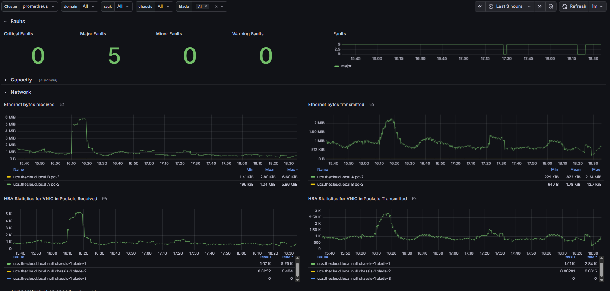

# prometheus-ucs-exporter

## Overview

Use metrics from the UCS API to export relevant metrics to Prometheus

This repository is a fork of Marshall Wace's exporter [MarshallWace/prometheus-ucs-exporter][fork] 
which was in turn forked from Drew Stinnett's original exporter at
[oit-ssi-systems/prometheus-ucs-exporter][original].

Modifications made include:
* Rebaselined to Python 3.14.2 and Alpine 3.23
* Updated HTTP headers to work with Prometheus 3.0
* Fixed broken graphs in Grafana dashboard
* Minor fixes and refactorings

[fork]: https://github.com/MarshallWace/prometheus-ucs-exporter
[original]: https://gitlab.oit.duke.edu/oit-ssi-systems/prometheus-ucs-exporter

Install the Grafana dashboard by importing the JSON file `grafana/dashboard.json`.



## Installation

Build and run with Docker:

```
docker build -t prometheus-ucs-exporter .

docker run -p 3001:3001 -e PORT=3001 \
-e PROM_UCS_USERNAME='ucs-mydomain\username' \
-e PROM_UCS_PASSWORD='passw0rd' \
ghcr.io/teebee-camx/prometheus-ucs-exporter:<version>
```

Fetch metrics:

```
curl http://localhost:3001/metrics?domain=my-domain.example.com
```

> Note: Metrics are fetched in a background worker after an initial scrape,
> since UCSM can be slow to respond.
> Continue polling the `/metrics` endpoint until metrics are returned.

## Usage

```
docker pull ghcr.io/teebee-camx/prometheus-ucs-exporter:<version>
```

## SPDX update

```
pip install --user pipx

pipx run reuse addheader --copyright "2025 TeeBee-CAMX" --license "GPL-3.0-only" *.py 
```

## Prometheus.yml config

Add the following configuration to your premetheus.yml file to start scraping.

```
  - job_name: 'UCS exporter'
    static_configs:
      - targets: ['ucs_exporter:3001']
    metrics_path: /metrics
    params:
      domain: [ucs.domain.name]
```
